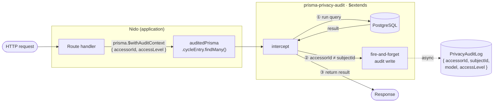

# Architecture — prisma-privacy-audit

See [RFC-001](docs/RFC-001-api-design.md) for open design questions.

---

## What it does

`prisma-privacy-audit` is a [Prisma Client Extension](https://www.prisma.io/docs/concepts/components/prisma-client/client-extensions).
It intercepts reads and writes on sensitive fields, logs cross-user access to a
`PrivacyAuditLog` table, and exposes GDPR Article 15 (export) and Article 17
(erasure) as first-class methods on the Prisma client.

Extracted from Nido, a platform in pilot handling GDPR special-category
data (menstrual health, mood, relationship agreements) for real users.

### Runtime flow



---

## Extension architecture

### Chaining with other extensions

`prisma-privacy-audit` is a standard `$extends` extension. Chain it last if you
also use field encryption; the audit layer needs to see plaintext:

```typescript
const prisma = new PrismaClient()
  .$extends(withEncryption({ encryptionKey: process.env.KEY })) // 47ng runs first
  .$extends(withPrivacyAudit({ ... }))                          // sees plaintext
```

Without encryption:

```typescript
const prisma = new PrismaClient()
  .$extends(withPrivacyAudit({ ... }))
```

Ordering constraints and known issues with `prisma-field-encryption` are in
[COMPATIBILITY.md](docs/COMPATIBILITY.md).

### Internal structure

Two extension types registered internally:

```
$extends({
  query:  { $allModels: { $allOperations } }        // intercepts reads and writes
  client: { $withAuditContext, exportUserData, eraseUserData }  // top-level methods
})
```

---

## Configuration

```typescript
withPrivacyAudit({
  // Required: which models and fields are sensitive
  sensitiveModels: {
    CycleEntry: {
      fields: ['notes'],          // fields to audit
      subjectField: 'userId',     // field identifying the data owner
    },
    MoodEntry: {
      fields: ['notes'],
      subjectField: 'userId',
    },
    AgreementParty: {
      fields: ['expectations', 'privateNotes'],
      subjectField: 'userId',
    },
  },

  // Optional: audit log behavior
  auditLog: {
    retention: 90,              // days before auto-purge (default: 90)
    logSelfAccess: false,       // log reads where accessor === subject (default: false)
    logWrites: false,           // log create/update of sensitive fields (default: false)
    samplingRate: 1.0,          // 0.0–1.0 fraction of reads to log (default: 1.0)
    onFailure: 'silent',        // 'silent' | 'store' | 'throw' (default: 'silent')
                                // 'store': failed entries written to PrivacyAuditDeadLetter
                                // table for inspection and retry
  },

  // Optional: DSR handler configuration
  dsr: {
    models: {
      CycleEntry:    { strategy: 'hard-delete' },
      MoodEntry:     { strategy: 'hard-delete' },
      Agreement:     { strategy: 'anonymize',  fields: ['content'] },
      AgreementParty:{ strategy: 'hard-delete' },
      DataAccessLog: { strategy: 'preserve' },  // legal record
    },
  },
})
```

---

## The accessor context problem

The core challenge: `$extends` interceptors run at the ORM layer. When
`prisma.cycleEntry.findMany(...)` is called, the interceptor can see the query
arguments and result but not who is making the request.

### `$withAuditContext`

The extension adds a `$withAuditContext` method that returns a request-scoped
client with the accessor identity bound:

```typescript
// In route middleware or request handler:
const auditedPrisma = prisma.$withAuditContext({
  accessorId: session.userId,
})

// reads through auditedPrisma are logged if cross-user
const cycleData = await auditedPrisma.cycleEntry.findMany({
  where: { userId: targetUserId },
})
// → DataAccessLog entry created:
//   accessorId=session.userId, subjectId=targetUserId,
//   model='CycleEntry', field='notes', action='read'
```

The interceptor compares `accessorId` (from context) with the value of
`subjectField` in the result. If they differ, it logs. Self-reads are skipped
by default.

For granular sharing, pass the access level too:

```typescript
const auditedPrisma = prisma.$withAuditContext({
  accessorId: session.userId,
  accessLevel: connection.cycleAccess,  // e.g. 'phase_only', 'full', 'basic'
})
```

The access level ends up in the log entry, so you can tell what sharing
permission was active when a specific read happened.

### Why not AsyncLocalStorage?

AsyncLocalStorage would propagate context implicitly and require no changes in
route handlers, which is appealing. I went back and forth on this. The problem
is debuggability; audit failures in a compliance library should be visible, not
implicit. Explicit `$withAuditContext` calls also show up in code review, which
matters when the question is "is this read being logged?". The full discussion is
in RFC-001.

AsyncLocalStorage also doesn't work on edge runtimes, which rules it out for v1.0.

---

## Audit log schema

The library uses a `PrivacyAuditLog` table. Add this to your Prisma schema:

```prisma
model PrivacyAuditLog {
  id          String   @id @default(cuid())
  accessorId  String                         // who accessed the data
  subjectId   String                         // whose data was accessed
  model       String                         // Prisma model name, e.g. 'CycleEntry'
  field       String?                        // specific field accessed, if known
  action      String                         // 'read' | 'write' | 'delete'
  accessLevel String?                        // e.g. 'phase_only', 'full', 'basic'
  createdAt   DateTime @default(now())

  @@index([accessorId])
  @@index([subjectId])
  @@index([createdAt])
}
```

`purgeExpiredLogs(prisma, retentionDays)` deletes entries older than `retentionDays`.
Call it on server startup or via cron; the library doesn't schedule it automatically.

The log table is not cryptographically signed in v1.0. The library protects against
application-layer access without logging; it doesn't protect against a DBA with
direct database access. That's a different threat model.

---

## DSR handler design

### Article 15: Export

```typescript
const { data } = await prisma.exportUserData({
  subjectId: userId,
  format: 'json',   // 'json' | 'csv' (csv flattens nested structures)
})

// data shape:
{
  exportedAt: '2026-03-07T19:00:00Z',
  schemaVersion: '1.0',
  subject: { id: userId },
  records: {
    CycleEntry: [...],
    MoodEntry: [...],
    // ... per-model results
  }
}
```

If used with `prisma-field-encryption`, encrypted fields come back decrypted.
GDPR requires giving users readable copies of their data, not ciphertext.

### Article 17: Erasure

```typescript
const { receipt } = await prisma.eraseUserData({
  subjectId: userId,
})

// receipt shape:
{
  erasedAt: '2026-03-07T19:00:00Z',
  subjectId: userId,
  actions: [
    { model: 'CycleEntry',    strategy: 'hard-delete', count: 42 },
    { model: 'MoodEntry',     strategy: 'hard-delete', count: 180 },
    { model: 'Agreement',     strategy: 'anonymize',   count: 3  },
    { model: 'PrivacyAuditLog', strategy: 'preserve',  count: 0  },
  ],
  receiptHash: 'sha256:...',  // hash of the receipt payload for non-repudiation
}
```

**Erasure strategies:**
- `hard-delete`: physical deletion (`deleteMany`)
- `anonymize`: nullify personal fields, preserve record structure
  (e.g., keep a signed agreement record but erase the signer's content)
- `preserve`: do not delete (audit logs are themselves legal records)

Erasure runs inside a Prisma transaction where possible. Models with `preserve`
strategy are excluded from the transaction.

---

## What this library doesn't do

- **Encryption at rest**: use [`prisma-field-encryption`](https://github.com/47ng/prisma-field-encryption)
- **Audit log UI**: headless, no dashboard
- **SIEM / log forwarding**: logs stay in your database, pipe them yourself
- **Other ORMs**: Prisma only, for now
- **Edge runtimes**: Node.js 18+ only in v1.0

---

## Where this lives in Nido

| Library feature | Nido source |
|---|---|
| `$extends` middleware | `apps/api/src/lib/prisma.ts` |
| `logDataAccess()` | `apps/api/src/lib/accessLog.ts` |
| Cross-user read logging | `apps/api/src/routes/cycle.ts`, `mood.ts` |
| Retention purge | `apps/api/src/lib/accessLog.ts` → wired in `index.ts` |
| DSR Export (Art. 15) | `apps/api/src/routes/auth.ts` (`GET /me/export`) |
| Soft-delete + grace period | `apps/api/src/routes/auth.ts` (`DELETE /account`) |
